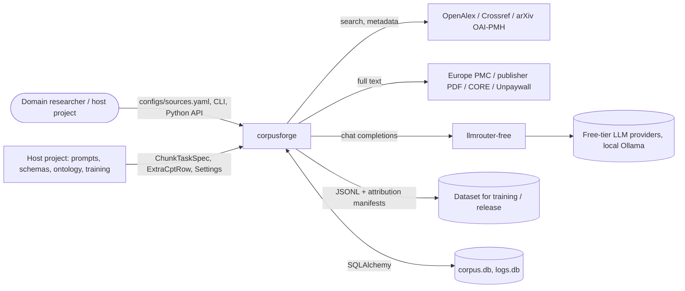

# 3. Context and scope

## Business context

| Partner | Interface | Data |
|---|---|---|
| OpenAlex, Crossref, arXiv | HTTPS GET via `PoliteClient` | Titles, abstracts, DOIs, licenses, links |
| Europe PMC, publishers, CORE, Unpaywall, PMC OA bucket | HTTPS GET | JATS XML, PDFs, figures |
| `llmrouter-free` | Python (`LLMRouter.complete`) | Prompts in, validated text out |
| Host project | Python API / CLI registration | Task specs, settings, extra CPT rows |
| Dataset consumer | Files | `cpt_*.jsonl`, `*.attribution.json`, `LICENSE_STATUS.json`, model card |

## Technical context
Two SQLite files by default: `corpus.db` (the corpus and task queue) and `logs.db` (structured logs plus the router's
`llm_call_metrics`). The router's ledger table `llm_calls` normally lives in `corpus.db` so that "requests used today"
and the response cache survive with the project.

## Scope
**In scope:** discovery, screening, fetch, parse/chunk, image download, the task queue and batched runner, failure triage
and blacklisting, splitting, near-duplicate detection, grounding check, CPT export with attribution, license gate,
model-card generation, structured logging, CLI.

**Out of scope (host project's job):** what to extract and how to prompt for it, the domain tables, SFT/DPO row
formats, ontologies, judging, training, evaluation. **Out of scope entirely:** reading figures or tables, OCR, bypassing
access controls, hosting datasets.
