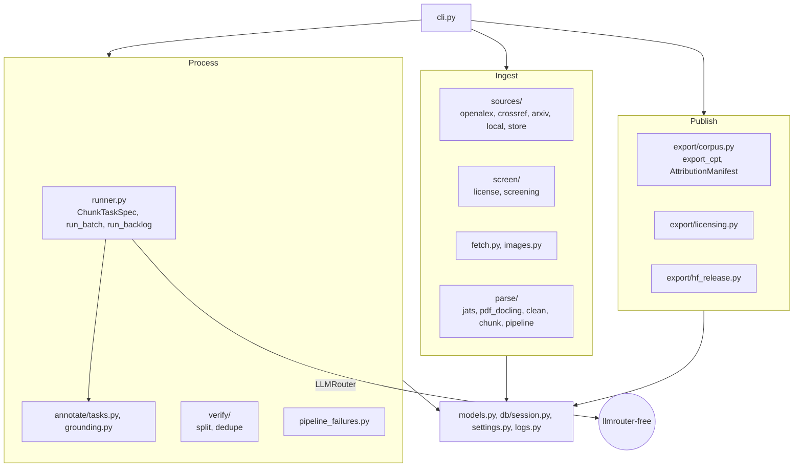
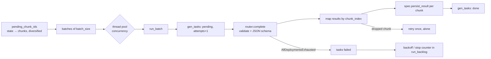

# 5. Building block view

## Level 1 - the package

| Block | Responsibility | Key interface |
|---|---|---|
| `models` | Core schema: `Document`, `File`, `Chunk`, `GenTask`, `Release`, on corpusforge's own `Base`. | SQLAlchemy models |
| `settings` | `Settings` (`CF_*`), `set_settings()`, `load_config()`, package/project path constants. | `get_settings()` |
| `db.session` | Engine (SQLite pragmas), session context manager, `migrate()`, `stamp()`. | `get_session()`, `migrate()` |
| `logs` | `DBLogHandler`, `LogEntry`, `configure_logging(roots=)`, query/stat/clear helpers. | `configure_logging()` |
| `sources.*` | Source adapters yield `DiscoveredRecord`s; `PoliteClient` is the only HTTP client; `store.upsert_records` de-duplicates and persists. | `Source.discover(terms, limit)` |
| `screen.*` | License normalization/gate; keyword relevance scoring; `screen_documents`. | `evaluate_license`, `screen_documents` |
| `fetch`, `images` | Full-text retrieval chain and figure download; `best_effort_url` for manual retrieval. | `fetch_document` |
| `parse.*` | JATS and Docling parsers to a common `ParsedDocument`; cleaning; section-aware chunking; idempotent persistence. | `parse_and_chunk`, `rechunk_from_existing_chunks` |
| `annotate.tasks` | Resumable job rows in `gen_tasks`. | `get_or_create_task`, `mark_done/failed` |
| `annotate.grounding` | Cheap "is this quote in the chunk" check. | `is_grounded` |
| `runner` | The batched chunk runner (see below). | `ChunkTaskSpec`, `run_batch`, `run_backlog` |
| `pipeline_failures` | Roll failed tasks up to documents; blacklist repeat offenders. | `failed_documents`, `blacklist_repeat_failures` |
| `verify.*` | Deterministic by-paper split; MinHash near-duplicate marking for any host table. | `assign_document_splits`, `mark_duplicates` |
| `export.corpus` | CPT export, attribution manifest, shared helpers for host row types. | `export_cpt`, `AttributionManifest`, `ExtraCptRow` |
| `export.licensing` | Read manifests, classify sources, filter JSONL, persist `LICENSE_STATUS.json`. | `classify_export` |
| `export.hf_release` | Model card from manifests; upload. | `build_model_card`, `ModelCardInfo` |
| `cli` | Typer app; pipeline commands registrable on a host app. | `register_pipeline_commands` |

## Level 2 - the runner

`ChunkTaskSpec` is the entire domain interface of the runner: `task_type`, `build_messages(texts)`, `response_schema`
(batch-shaped, `results[*].chunk_index`), `persist_result(session, chunk, chunk_result, model) -> payload`,
`output_tokens_per_chunk`, `route`, `temperature`.
