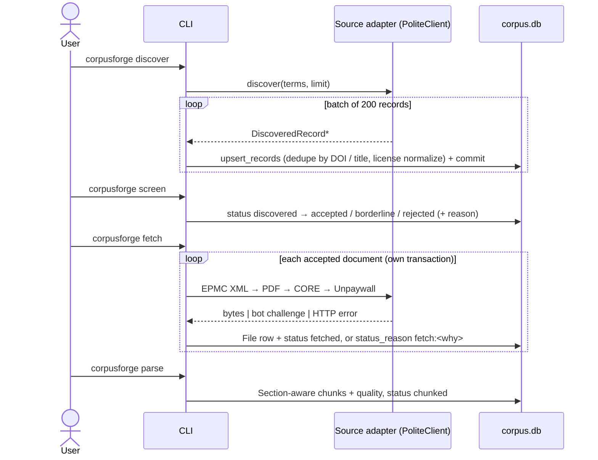

# 6. Runtime view

## Scenario A - discover to chunked

Failure handling: a bot challenge raises `BlockedByBotProtection`; `discover` stops that *source* (not the run),
`fetch` records `fetch:bot_protection` for the document and moves on. Nothing is retried around a challenge.

## Scenario B - a batched annotation run

1. `run_backlog` asks `pending_chunk_ids` for chunks of `chunked`, non-blacklisted documents with no `done` task of this
   `task_type`, round-robined across documents, truncated to `limit`.
2. It slices them into batches and submits up to `concurrency` `run_batch` calls to a thread pool.
3. `run_batch` (own short session): create/find each chunk's `gen_tasks` row, skip `done`, `attempts += 1`, commit.
4. **No transaction open**: `router.complete(route, messages, validate=json_validator(schema), response_format=..., max_tokens=N*budget)`.
5. Short session: for each returned `chunk_index` in range, `spec.persist_result(...)`; mark those tasks `done` with the
   returned payload.
6. Chunks the model omitted are re-run once alone; still missing -> `failed`.
7. Back in `run_backlog` (main thread): if *every* chunk of a batch failed, log a warning, print the resume time,
   re-queue the batch `retry_wait_seconds` later; the 10th consecutive such batch sets `stopped` and ends submission
   (in-flight batches finish). Otherwise counters and the progress table update.

## Scenario C - interrupted run
`Ctrl-C` at any point leaves: committed records/documents, `done` tasks, `failed`/`pending` tasks. The next run selects
exactly the chunks without a `done` task. Re-running a finished command is a no-op.

## Scenario D - export
`export_cpt` selects chunks whose document has a `split` and is not blacklisted, optionally packs a document's
consecutive chunks up to `pack_tokens`, strips overlap prefixes, appends `extra_rows` to `train`, records every row in
the `AttributionManifest`, then writes JSONL plus one manifest per split.
