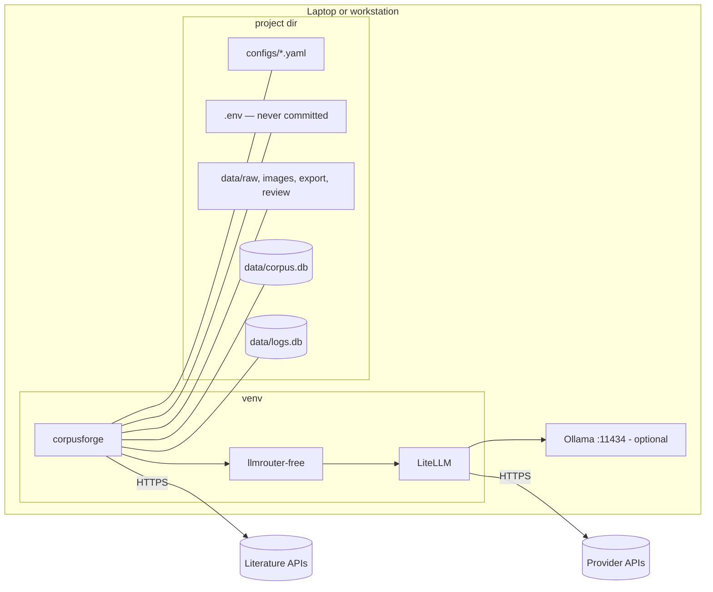

# 7. Deployment view

corpusforge is a library plus a CLI; there is no server. It runs wherever Python runs, against files in a **project
directory** (the current working directory).

| Node | Notes |
|---|---|
| Python env | `uv pip install "corpusforge[parse] @ git+https://github.com/fredbuildsai/corpusforge.git@v0.1.0"`; pulls `llmrouter-free` from its GitHub tag. |
| Project directory | Created by `corpusforge init`. Everything mutable lives here; the package itself is read-only. |
| SQLite files | WAL journal; safe for one process with threads. Point `CF_DATABASE_URL` at PostgreSQL for multi-process work. |
| Ollama | Optional local fallback model, configured in `llm_routes.yaml`. |
| CI | GitHub Actions: pytest + ruff on Python 3.11/3.12. |

Upgrade path: install the new tag, run `corpusforge db init` (migrations are idempotent and use a private version table).
